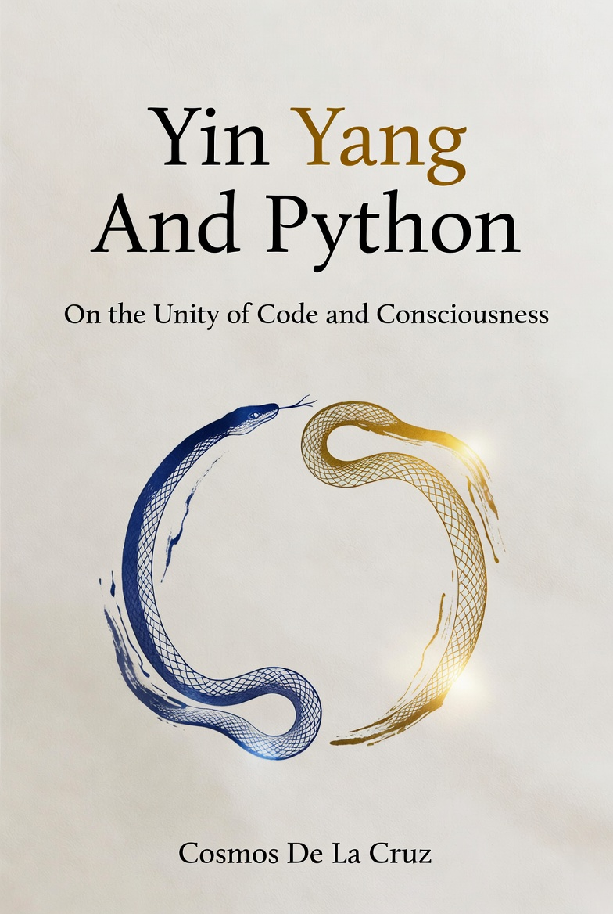

# Yin Yang And Python
## *By Cosmos De La Cruz*

  

 

---

> *"Programs must be written for people to read,*
> *and only incidentally for machines to execute."*
> — Harold Abelson

> *"The Tao that can be named is not the eternal Tao."*
> — Lao Tzu

---

## The Book Nobody Wrote

Every Python tutorial will teach you what to type and how to type it.

Nobody — not one of the thousands of programming books published in the last thirty years — has stopped to ask the question that actually matters:

**Why does any of this exist?**

Why does a variable exist? Why does a loop exist? Why does a function exist? What does it *mean* to name something in code? What does it mean to make a choice, to repeat an action, to define a pattern that can be invoked? What is the relationship between the act of programming and the act of thinking? Between writing code and writing a life?

This book is the answer to those questions.

*Yin Yang And Python* is not a syntax guide. It is not a beginner's tutorial. It is not another book that will teach you to build a todo app in chapter three and forget about it by chapter eight.

It is a philosophical investigation of programming — written by someone who came to code not through a computer science degree, not through a corporate training program, but through a night meditation at twenty-four years old, when a single word inscribed itself in the silence: *Programming.*

This book is what happened next.

---

## What This Book Is

At its core, *Yin Yang And Python* makes one radical claim:

**Programming is a spiritual practice.**

Not as a metaphor. Not as inspiration-poster wisdom. As a literal, precise, defensible truth.

Every principle that the contemplative traditions — Taoism, Zen Buddhism, Stoicism, Hermeticism, Yoga — have identified as essential to awakening is also essential to excellent programming. Presence. Clarity. Single-pointed intention. Equanimity in the face of failure. Non-attachment to cleverness. The discipline that becomes freedom.

This is not a coincidence. It is correspondence. *As above, so below.*

The Python logo — two serpents intertwined, one blue, one gold, dancing in a circle — is not arbitrary. It is a map. The blue serpent is logic, analysis, structure, the Yang of the mind. The gold serpent is intuition, synthesis, creativity, the Yin. Most programmers use only one. The masters let both dance. This book teaches you to dance.

---

## Who This Book Is For

This book is for anyone who has ever felt that the programming tutorials were teaching them the *what* and the *how* and skipping the only question that actually matters.

It is for the developer who codes all day and meditates in the morning and has always felt, quietly, that these two activities were secretly the same activity.

It is for the philosophy student who suspects that the history of ideas — from Aristotle to Wittgenstein, from Lao Tzu to Carl Jung — has something to say about how software should be written.

It is for the beginner who is not yet a programmer but knows, with the bone-deep certainty that only comes from something true, that they are supposed to be one.

It is for the experienced engineer who has written a hundred thousand lines of code and has a nagging feeling that they have been doing it efficiently but not deeply.

It is not for the reader who wants quick answers. It is for the reader who understands that the slow answer — the one that goes all the way down to the roots — is the only answer worth having.

---

## A Note on What This Book Is Not

There is no code in these pages.

Not because code is unimportant. The companion volumes — *The Yin Yang of Python* (English) and *El Yin Yang de Python* (Spanish) — are full of it, written with the same philosophical care that animates these chapters.

But philosophy and code are not the same activity, and they do not belong in the same book. Philosophy asks *why*. Code asks *how*. This book answers the first question, fully and without apology, so that the second question can be answered with intelligence rather than with mechanical habit.

Read this first. Then write the code.

Or read it alongside. Or after. There is no wrong order. But read it with a pen, because you will want to write in the margins. The ideas here are not meant to be consumed — they are meant to be *continued*.

---

## The Thesis, One Last Time

The serpents are dancing.

They were always dancing. The separation between logic and soul, between science and spirit, between the programmer and the contemplative — this separation is not a discovery. It is a habit. A forgetting. A line drawn in the sand that nobody had the authority to draw.

This book is an act of remembering.

Python is a philosophy of balance encoded in syntax. And if you learn to read it that way — not as a set of commands to be memorized but as a set of principles to be understood — you will find that you are not just learning to program.

You are learning to think.

And thinking, done well, is the beginning of everything.

---

*Yin Yang And Python*
*By Cosmos De La Cruz*
*© 2026 — All rights reserved*

*"I think every human being is an individual manifestation of the cosmos."*

---
